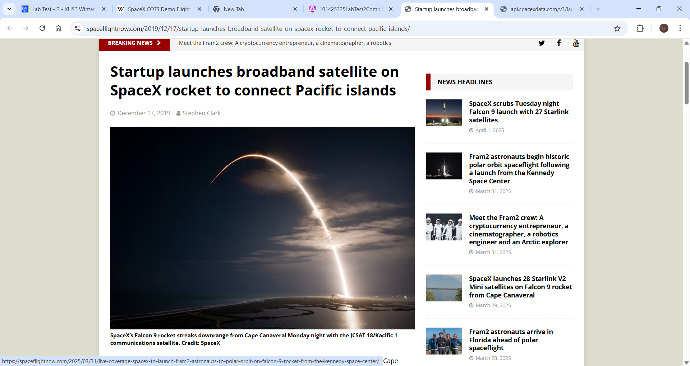

# 101425325LabTest2Comp3133

This project was generated using [Angular CLI](https://github.com/angular/angular-cli) version 19.2.1.

## Objective

Create an Angular application to implement the following features:

### Instructions

1. **Create the Angular Application** (10 points)  
   - Create an Angular app named `101425325-lab-test2-comp3133`.  
   - Initialize a GitHub repository and commit all your code to it.

2. **Host the Application** (10 points)  
   - Deploy your Angular application on a hosting platform (e.g., Vercel, Railway, Render, Docker, etc.).

3. **Create MissionList Component** (20 points)  
   - Create a component named `missionlist` to display a list of all SpaceX launches using the provided REST API endpoint.  
   - Display the following fields for each mission:  
     - `flight_number`  
     - `mission_name`  
     - `launch_year`  
     - `details`  
     - `mission_patch_small`  
     - Rocket Info:  
       - `rocket_name`  
       - `rocket_type`  
     - Links:  
       - `mission_patch_small`  
       - `article_link`  
       - `wikipedia`  
       - `video_link`

4. **Implement Search or Filter by Launch Year** (10 points)  
   - Create a `missionfilter` component that allows users to search/filter missions by their launch year.

5. **Create MissionDetails Component** (20 points)  
   - Create a component named `missiondetails` to display detailed information about a selected mission from the `missionlist`.  
   - Use `@Input()` or a route parameter to pass data to the `missiondetails` component.

6. **Create Service to Fetch Data** (10 points)  
   - Create a service to fetch data from the SpaceX REST API.

7. **Create Interface/Class for Data Structure** (10 points)  
   - Define a TypeScript interface or class that describes the structure of the SpaceX mission data.

8. **Use Angular Material for Design** (10 points)  
   - Use Angular Material components to enhance the UI and UX of the application.

---

## Development server

To start a local development server, run:

```bash
ng serve
```

Then navigate to `http://localhost:4200/`. The app will auto-reload on file changes.

## Code scaffolding

Generate a new component:

```bash
ng generate component component-name
```

To see all schematics:

```bash
ng generate --help
```

## Building

Compile the project using:

```bash
ng build
```

Artifacts will be stored in the `dist/` directory. Production build is optimized.

## Running unit tests

Run unit tests using [Karma](https://karma-runner.github.io):

```bash
ng test
```

## Running end-to-end tests

Run e2e tests:

```bash
ng e2e
```

Note: Angular CLI does not include an e2e framework by default — choose one as per your need.

## Additional Resources

- [Angular CLI Documentation](https://angular.dev/tools/cli)


---

## Screenshots
Fetch All Missions


Filter by Year


Mission Detail


Article


Wikipedia


Video

